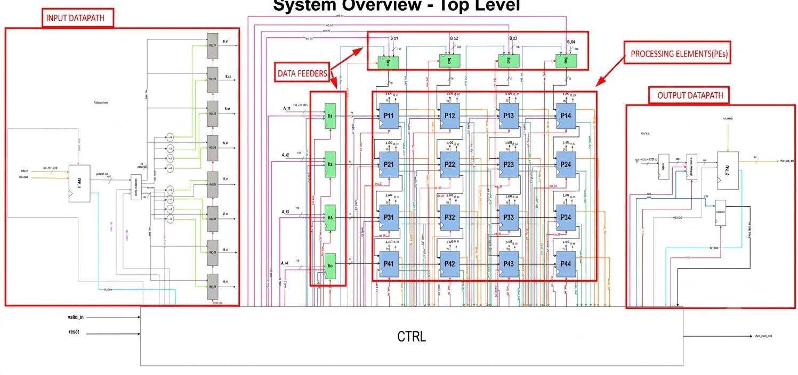

# RTL-to-GDSII Design of a Configurable Matrix Accelerator IP on GF180MCU


-blue)


## Overview

This project implements a configurable **NxN systolic matrix accelerator IP** targeting **GF180MCU**, following a complete **RTL-to-GDSII** design flow. The architecture consists of modular **Processing Elements (PEs)** built around an **approximate logarithmic MAC unit** to improve hardware efficiency.

The current design uses **FP16 inputs**, performs approximate floating-point multiplication, converts the result to fixed-point, and accumulates partial sums using a **32-bit Q16.16 accumulator**. While the architecture is fully parameterized, the current implementation and validation are based on a **4×4 systolic array**, with FPGA validation on the **Xilinx Nexys A7**.

---

## Design Specifications

| Specification | Details |
|--------------|---------|
| Project Name | RTL-to-GDSII Design of a Configurable Matrix Accelerator IP on GF180MCU |
| Track | A |
| Team | A34 – SiliconForge |
| Target Technology | GF180MCU |
| Hardware Description Language | Verilog |
| Target Flow | RTL → FPGA Validation → RTL-to-GDSII |
| Architecture | Parameterized NxN Systolic Array |
| Demonstration Configuration | 4×4 Systolic Array |
| Compute Unit | Processing Element (PE) |
| Arithmetic Unit | Approximate Multiply-Accumulate (MAC) |
| Input Precision | FP16 (IEEE-754 Half Precision) |
| Multiplier Output | FP16 (Approximate Logarithmic Multiplier) |
| Accumulator Precision | Q16.16 (32-bit Fixed Point) |
| Interface | Ready-Valid Protocol + SPI |
| FPGA Platform | Xilinx Nexys A7 |
| ASIC Block | Block B |
| Estimated Area | 1117 μm × 558 μm |
| Available Pins | 16 |
| Optional Extension | Lightweight Open-Source RISC-V Integration |

---


## Project Resources

| Resource | Link |
|----------|------|
| GitHub Repository | https://github.com/Waleed99i/chipathon-2026-systolic-ip-core |
| PadFrame Proposal | https://docs.google.com/presentation/d/1hGlZvZFFLWlx8hJLkmKaFUCYW1uyk7dkF3z44zS5dTQ/edit?usp=sharing |
| Proposal Slides | https://docs.google.com/presentation/d/1u3HMhi0KsbPWeEo2SdxVy66h3A2EKqcJ1DBfrJLO6gw/edit?usp=sharing |
| Detailed Proposal | https://docs.google.com/document/d/1xj1mtmIwVFShTZUq7PKGKg6W1PffVR4_vp0zMOgc8iE/edit?usp=sharing |
| Pin Requirements | https://docs.google.com/spreadsheets/d/1KH9oZjetv38rxIAL1lnZPNvuW3Qhh9-GSiZVkqRqzDc/edit?usp=sharing |
| Progress Tracker | https://docs.google.com/spreadsheets/d/1-T_ZC2E8IlozA7BDgOPqUjp5dZac3WXzmJ67Tr54c2c/edit?usp=sharing |
| Proposal Presentation Video | https://youtu.be/i-fauhB5LK8 |
| Schematic Review Slides | https://docs.google.com/presentation/d/1XbPeDPZbSCVIkTJ6YJzha1Qlfp463J90a_zdM6emGkA/edit?usp=sharing |
| Schematic Review Presentation | https://youtu.be/ZGd18GQEK7I?si=cJApcDfwtI_DK_bS |
| Layout Review Slides | TBA |


---


## Project Goals

The primary objective of this project is to design a configurable systolic matrix accelerator IP capable of accelerating matrix multiplication workloads for machine learning and digital signal processing applications. The design emphasizes modularity, scalability, and hardware efficiency while following a complete ASIC design methodology.

Key design objectives include:

- Parameterized NxN systolic array architecture
- Modular Processing Element (PE) based design
- Approximate MAC implementation for reduced hardware complexity
- Ready-Valid protocol based communication
- FPGA validation prior to ASIC implementation
- Optional lightweight RISC-V integration
- OR integration with a ML Framework
- Tapeout-ready RTL targeting GF180MCU

---

# System Architecture

The accelerator consists of a parameterized systolic array built from Processing Elements (PEs). Each PE performs Multiply-Accumulate (MAC) operations while forwarding operands to neighboring PEs, enabling highly parallel matrix multiplication.

Current demonstrations are based on a **4×4 systolic array**, while the RTL is being developed to support configurable **NxN** array dimensions.

<div align="center">

**Top-Level Architecture**



</div>

---

## Data Flow

```
             Input Matrix A
                    │
                    ▼
            Input Datapath
                    │
                    ▼
             Data Feeders
                    │
                    ▼
      ┌─────────────────────────┐
      │ Parameterized NxN       │
      │     Systolic Array      │
      │                         │
      │    Processing Elements  │
      └─────────────────────────┘
                    │
                    ▼
            Output Datapath
                    │
                    ▼
              Output Results
```

and will do integration afterwards with riscv core or ML framework

---
# Major Hardware Blocks

| Block | Inputs | Outputs | Description |
|------|--------|---------|-------------|
| **MAC Unit** | FP16, FP16 | Q16.16 | Performs approximate logarithmic multiplication on two FP16 operands, converts the product to fixed-point, and accumulates the result using a 32-bit Q16.16 accumulator. |
| **Processing Element (PE)** | FP16 activation, FP16 weight | FP16 activation, FP16 weight, Q16.16 partial sum | Core computational element of the systolic array. Each PE performs one MAC operation while forwarding activations and weights to neighboring PEs. |
| **Input Datapath** | **16 × 2N** | **16 × (2N-1)** | Accepts the external input stream, separates activations and weights, and prepares row and column data streams for the Data Feeders. |
| **Data Feeders** | **16 × (2N-1)** | **FP16 streams** | Aligns and schedules incoming operands with appropriate delays before injecting them into the systolic array. |
| **Ready-Valid (RV) Interface** | Ready, Valid, Data | Ready, Valid, Data | Implements a standard ready-valid handshake protocol for modular communication between external logic and the accelerator. |
| **Output Datapath** | **32 × (N × N)** | **64** | Collects the final outputs from every Processing Element and formats the result matrix for external transfer. |
| **Register** | Data, Clock, Reset | Registered Data | Pipeline register with reset logic and multiplexing support. Stores intermediate values between clock cycles. |
| **Counter** | Clock, Reset | Count | Controls systolic computation timing. Counts from **0** to **2N−1** (0–7 for a 4×4 array). |

In Our Example N=4 since 4x4 systolic


---

# Chip Information

| Item | Value |
|------|-------|
| Chip Block | B |
| Fraction of Chip | 1/8 |
| Estimated Area | 1117 μm × 558 μm |
| Digital Pins | 16 |
| Supply | Single VDD |
| Ground | Common GND |

---

# Pin Configuration

| Pin | Signal | Direction | Type | Description |
|----|--------|-----------|------|-------------|
| 1 | clk | Input | Digital | System Clock |
| 2 | rst_n | Input | Digital | Active-Low Reset |
| 3 | spi_clk | Input | Digital | SPI Clock |
| 4 | spi_mosi | Input | Digital | SPI Master-Out Slave-In |
| 5 | spi_miso | Output | Digital | SPI Master-In Slave-Out |
| 6 | spi_cs_n | Input | Digital | SPI Chip Select |
| 7–12 | data_in[5:0] | Input | Digital | Accelerator Input Data Bus |
| 13–14 | data_out[1:0] | Output | Digital | Accelerator Output Data Bus |
| 15 | VDD | Power | Power | Supply Voltage |
| 16 | GND | Power | Ground | Common Ground |


---

# Design Flow

The development follows a structured hardware design methodology beginning from architecture definition and RTL implementation, progressing through verification and FPGA validation, and culminating in an ASIC RTL-to-GDSII flow targeting GF180MCU.

```
Architecture Design
        │
        ▼
RTL Development
        │
        ▼
Module Verification
        │
        ▼
System Integration
        │
        ▼
FPGA Validation
        │
        ▼
RTL Synthesis
        │
        ▼
Physical Design
        │
        ▼
Signoff Verification
        │
        ▼
GDSII Generation
```

---

# Development Roadmap

The project follows a structured four-phase implementation strategy, progressing from RTL development to ASIC implementation.

| Phase | Objectives |  | Status |
|--------|------------|------|--------|
| **Phase 1** | Approximate MAC, Processing Element (PE), Parameterized Systolic Array RTL, Functional Verification | | In Progress |
| **Phase 2** | Input/Output Datapaths, Data Feeders, Ready-Valid Interface, System Integration | | In Progress |
| **Phase 3** | FPGA Synthesis & Validation, Performance Optimization | | Pending |
| **Phase 4** | RTL Synthesis, Physical Design, Signoff Verification, RTL-to-GDSII | | Pending |

---

# Current Progress


A detailed project tracker is available here:

[Progress Tracker](https://docs.google.com/spreadsheets/d/1-T_ZC2E8IlozA7BDgOPqUjp5dZac3WXzmJ67Tr54c2c/edit?usp=sharing)


---

# Success Metrics

The project will be considered successful upon meeting the following objectives.

| Metric | Target |
|---------|--------|
| Functional Correctness | Complete matrix multiplication verified through simulation and FPGA validation |
| Frequency | Meet timing for the target GF180MCU implementation |
| Area | Fit within the allocated **Block B (1117 μm × 558 μm)** |
| Throughput | Sustain one MAC operation per Processing Element per clock after pipeline fill |
| Scalability | Support parameterized NxN systolic arrays |
| FPGA Validation | Successful implementation on Xilinx Nexys A7 |
| ASIC Flow | Successful RTL-to-GDSII implementation using GF180MCU |


---

# FPGA Validation

The Approximate MAC architecture has been synthesized and validated on the **Xilinx Nexys A7 FPGA**.

Future FPGA validation includesComplete Synthesis of Systolic Array

---

# ASIC Design Flow

The project targets a complete RTL-to-GDSII implementation using the **GF180MCU** technology.

The planned backend flow includes:

- RTL Synthesis
- Static Timing Analysis
- Floorplanning
- Power Planning
- Placement
- Clock Tree Synthesis
- Routing
- DRC
- LVS
- Signoff
- GDSII Generation

---


# Team

| Member | GitHub | Discord | Affiliation | Role |
|----------|--------|----------|-------------|------|
| Muhammad Waleed Akram | Waleed99i | waleed_07 | University of Engineering and Technology, Lahore (Undergraduate) | Team Lead |
| Abdul Muiz | abdmz162 | abdmz | University of Engineering and Technology, Lahore (Undergraduate) | RTL Designer |
| Rumali Siddiqua | Rumali-Siddiqua | rumali24 | University of Virginia, USA (PhD Student) | Physical Designer |
| Nur Cahyo Ihsan Prastyawan | cprastyawan | chyp2640 | Universitas Gadjah Mada, Indonesia (Master's Graduate) | RTL Designer |

---


# License

This project is licensed under the Apache License 2.0.

See the **LICENSE** file for details.
